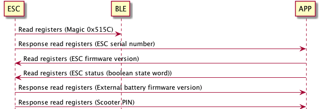

# 9-analyzer

## Introduction

This is a quick Node.js project developped to demonstrate how to parse communications logs extracted from the Ninebot electric scooters internal serial communication bus.

## Roadmap

- Decoding address ✅
- Read ASCI formatted logs ✅
- Decoding commands and arguments meanings ✅
- Read pure hexfiles logs ✅
- Group dataframes together
- Display visual frame transaction sequences ✅
- ...
- Elon Musk on Mars

## Install

```bash
git clone https://github.com/rascafr/9-analyzer.git

cd 9-analyzer

npm i
```

## Run

Either production or development (code monitoring, `nodemon` required)

```bash
# prod
npm start

# dev
npm run dev
```

## UML

PlantUML sequence diagram can be generated using this tool.

You need to download the [PlantUML jar executable](http://sourceforge.net/projects/plantuml/files/plantuml.jar/download) on your machine. 

Then, just set the environment variables `PLANTUML_JAR` as the path of the executable.

**Example:** (MacOS / Linux)

```bash
export PLANTUML_JAR="~/Documents/plantuml.jar"
```

The generated file will look like:




## Getting new logs

Use a serial-USB adapter, and use the following settings:

- 115200 bd/s
- 8 data bits
- 1 stop bit
- no parity

Incoming data will be sent by the scooter on the yellow wire connected to the dashboard. 

Ground (OV) is the black wire. Connect both files to your serial-USB adapter on *RX* and *GND*.

## Arduino

Some Arduino code is present insinde of this repos, can be used to parse on the fly some of the serial commands in "realtime".

## Sources

Some reverse engineering on my own.

Also, lot of information here about the protocol: https://github.com/etransport/ninebot-docs/wiki/ES2ESC